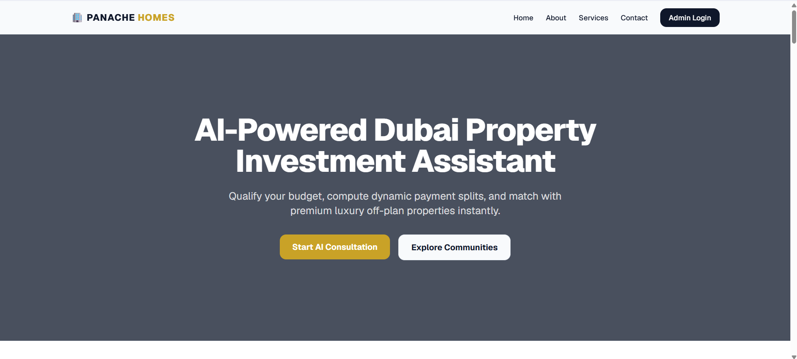
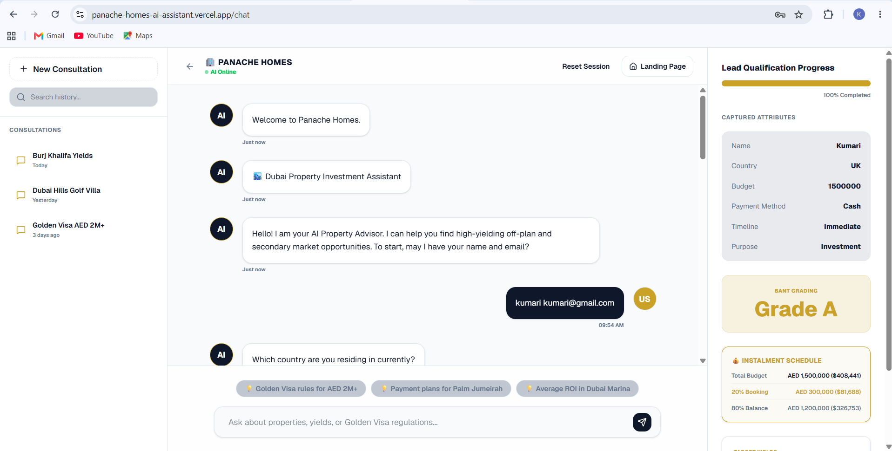
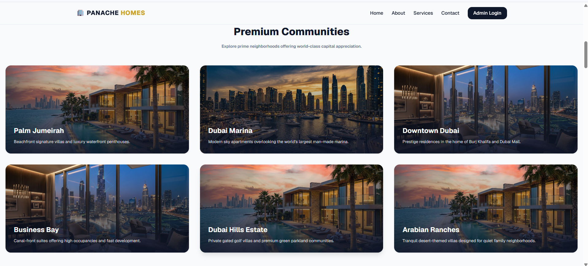
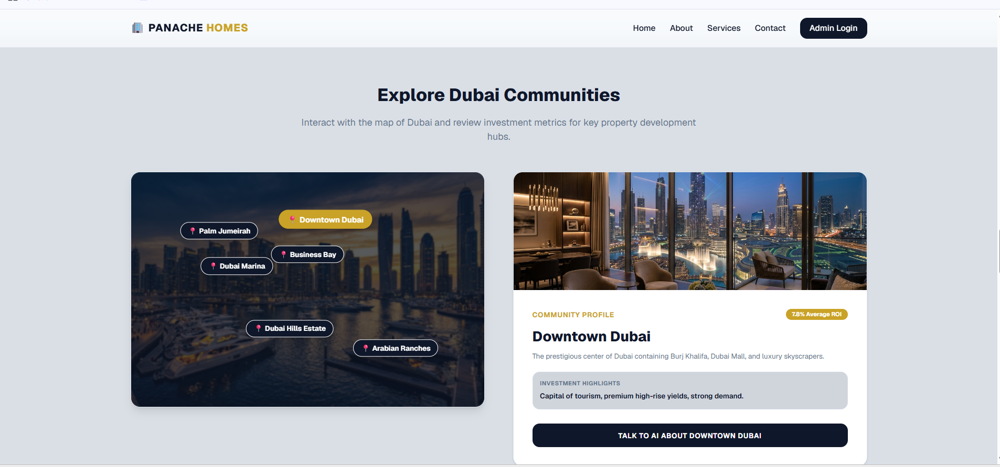
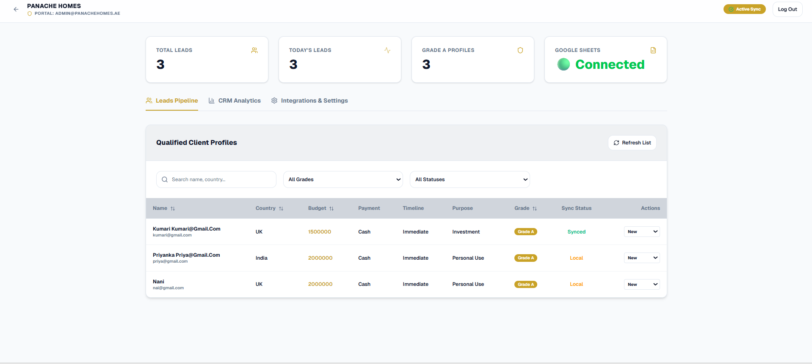
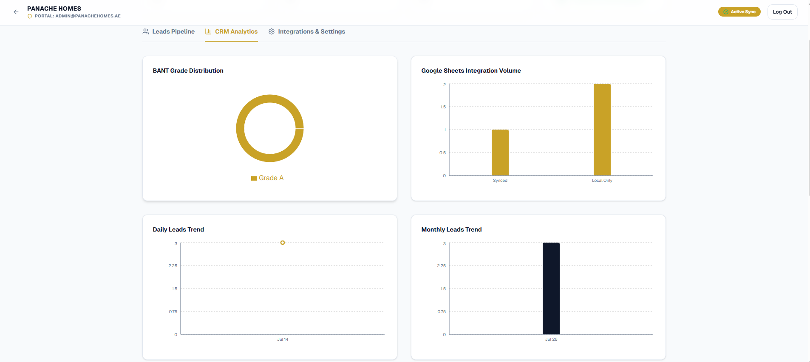
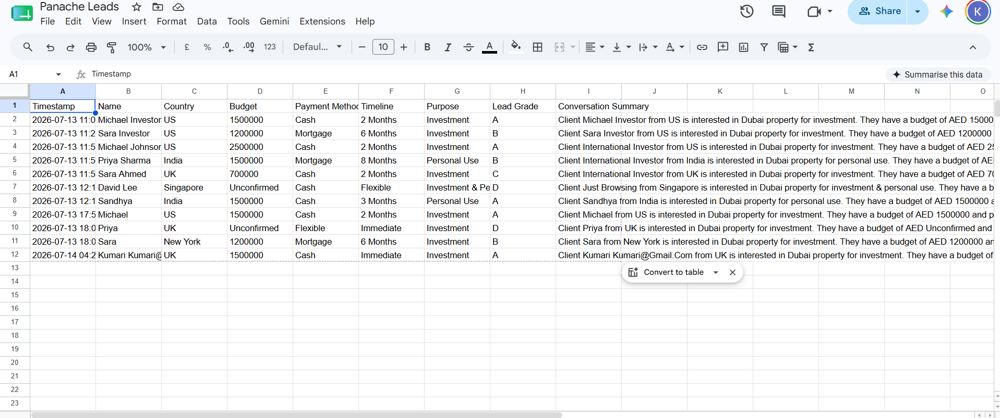
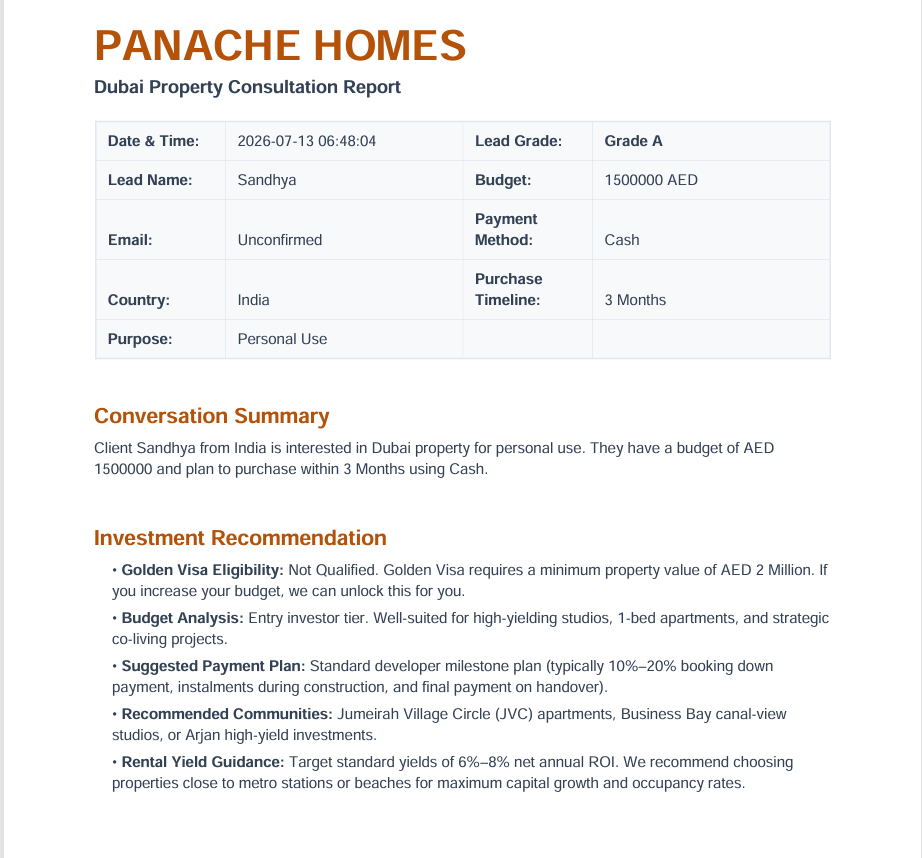
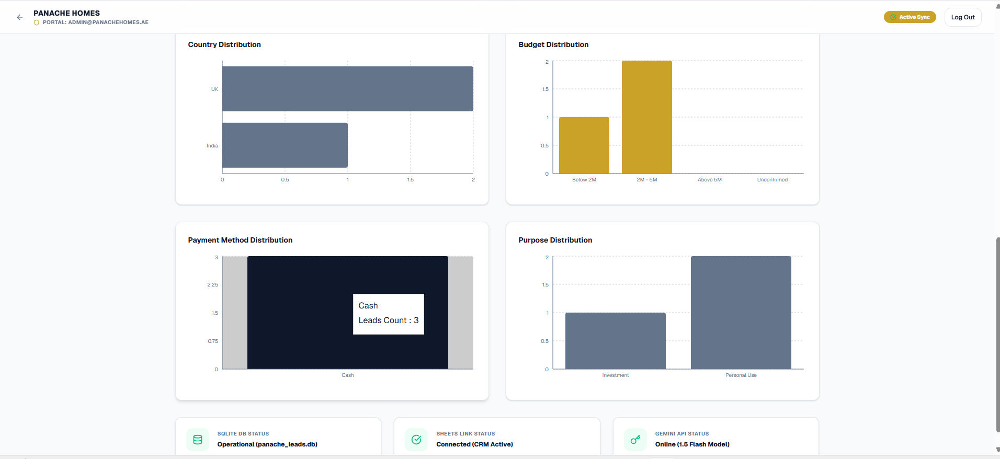

# 🏡 Panache Homes AI Lead Assistant

<p align="center">


</p>

---

## 📖 Overview

Panache Homes AI Lead Assistant is a full-stack AI-powered CRM designed for luxury real estate lead qualification.

The system interacts with potential property buyers, intelligently collects lead information using the **BANT Framework (Budget, Authority, Need, Timeline)**, grades the lead, generates an AI-powered advisory, synchronizes qualified leads with Google Sheets, and provides an analytics dashboard for administrators.

---

# 🚀 Live Demo

### 🌐 Frontend

https://panache-homes-ai-assistant.vercel.app

### ⚙️ Backend API

https://panache-backend-jb54.onrender.com

### 📘 API Documentation (Swagger)

https://panache-backend-jb54.onrender.com/docs

---

# ✨ Features

## 🤖 AI Chat Assistant

- Conversational lead qualification
- Context-aware responses
- Dubai property recommendations
- Knowledge Pack integration
- AI-generated conversation summaries

---

## 📊 BANT Lead Qualification

Automatically evaluates leads based on:

- 💰 Budget
- 👤 Authority
- 🎯 Need
- ⏳ Timeline

Generates:

- Grade A
- Grade B
- Grade C
- Grade D

---

## 📄 PDF Advisory Reports

Automatically generates:

- Lead summary
- Qualification report
- Personalized advisory
- Downloadable PDF

---

## 📈 CRM Dashboard

Features include:

- Total Leads
- Today's Leads
- Grade Analytics
- Lead Pipeline
- Status Tracking
- Google Sheets Connection Status

---

## 📑 Google Sheets Integration

Automatically syncs:

- Lead Name
- Country
- Budget
- Timeline
- Purpose
- Grade
- AI Summary

---

## 🔐 Authentication

- JWT Authentication
- Protected Admin Dashboard
- Secure Login

---

# 🛠 Tech Stack

## Frontend

- Next.js 16
- React
- TypeScript
- Tailwind CSS
- Axios

---

## Backend

- FastAPI
- Python
- SQLite
- JWT Authentication

---

## AI

- Google Gemini API

---

## Integrations

- Google Sheets API
- PDF Generation

---

## Deployment

Frontend

- Vercel

Backend

- Render

---

# 📂 Project Structure

```
panache-homes/

├── backend/
│   ├── api.py
│   ├── database.py
│   ├── services/
│   ├── knowledge_base.json
│   └── requirements.txt
│
├── frontend/
│   ├── src/
│   ├── public/
│   ├── app/
│   └── package.json
│
└── README.md
```

---

# 📸 Screenshots


🏠 Home Page



---

🤖 AI Chat Assistant



---

🏙️ Property Gallery



---

🌍 Community Explorer



---

📋 Lead Pipeline



---

📊 CRM Dashboard



---

📄 Google Sheets Integration



---

📑 PDF Advisory Report



---

📈 CRM Analytics



# 🔄 Workflow

```
Visitor

↓

AI Chat Assistant

↓

Lead Qualification

↓

BANT Scoring

↓

SQLite Database

↓

Google Sheets

↓

CRM Dashboard

↓

PDF Advisory Report
```

---

# 📊 API Endpoints

| Endpoint | Method |
|------------|----------|
| /api/chat | POST |
| /api/leads | GET |
| /api/leads | POST |
| /api/login | POST |
| /api/google-sync | POST |
| /api/leads/{id}/pdf | GET |
| /api/health | GET |

---

# 🚀 Installation

Clone repository

```bash
git clone https://github.com/Navyasri-270/panache-homes-ai-assistant.git
```

Backend

```bash
cd panache-homes/backend

pip install -r requirements.txt

uvicorn api:app --reload
```

Frontend

```bash
cd panache-homes/frontend

npm install

npm run dev
```

---

# 👩‍💻 Author

**Navya Sri**

B.Tech Computer Science

GitHub

https://github.com/Navyasri-270

---

# ⭐ Acknowledgements

Built as an AI-powered CRM solution for luxury real estate lead qualification using modern full-stack technologies and Google Gemini AI.
